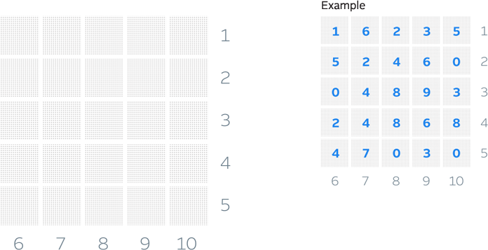

# Sum of Squares

#### Question
> Place a digit in each of the 25 spots in the below 5×5 grid, 
so that each 5-digit number (leading zeroes are ok) 
reading across and reading down is divisible by the 
number outside the grid, trying to maximize the sum 
of the 25 numbers you enter. An example of a completed 
grid with sum 100 is presented.

##

> Please submit your answer (along with any other comments you want to provide) as an ordered pair of your sum, and your 25 numbers, reading left to right, top to bottom.

`Example submission: (100, 1623552460048932486847030)`

